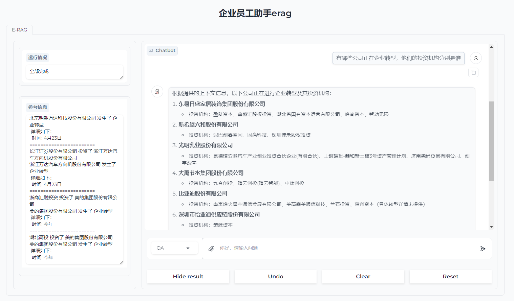
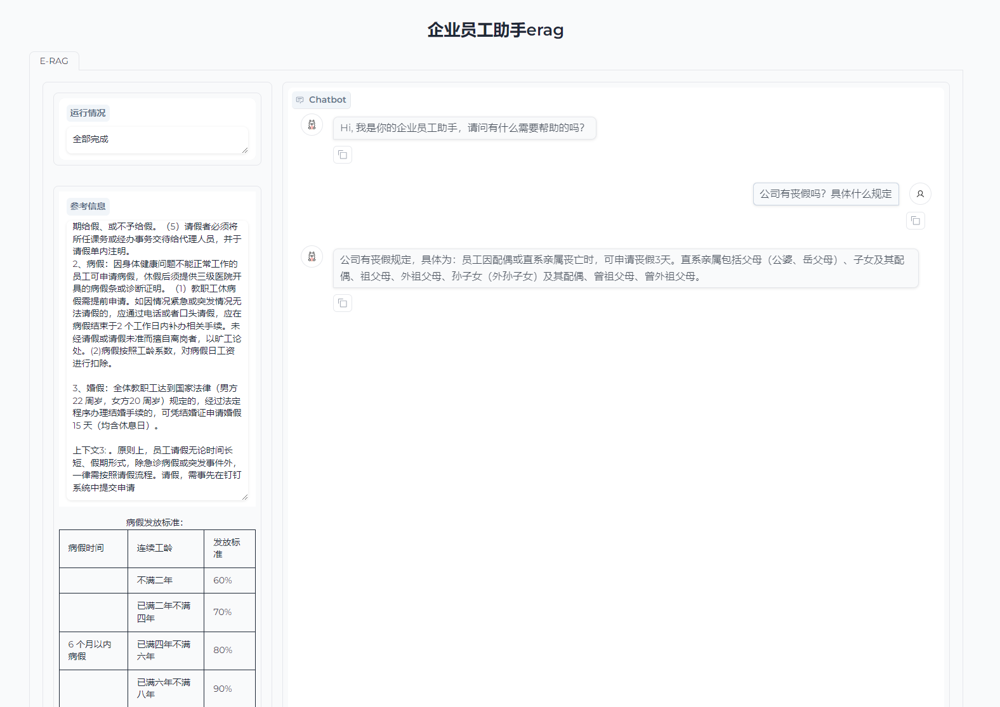
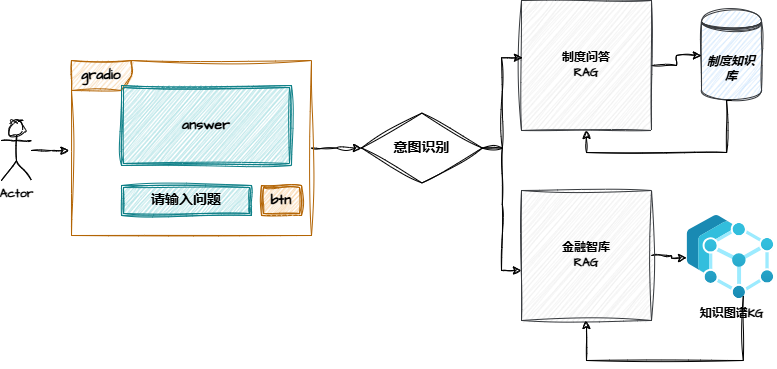
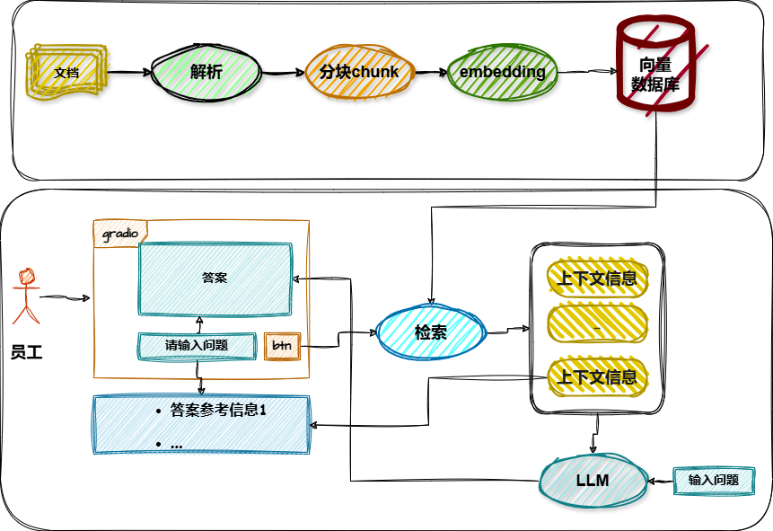

# RAG项目整合展示

## 1. 项目说明

这个是基于gradio实现的企业员工助手e-rag的前台文本展示，效果图如下：






**整体项目结构为：**






## 2. 执行

- 环境安装参见项目：[RAG全栈技术实战指南-环境安装文档](https://git.imooc.com/coding-920/RAG_full_stack_course_notebooks/src/master/install "")

- 项目启动

``` shell


uvicorn erag:app --host 1270.0.0.1 --port 7680 --worker 4

# 在浏览器中输入 http://127.0.0.1:7680/erag
```