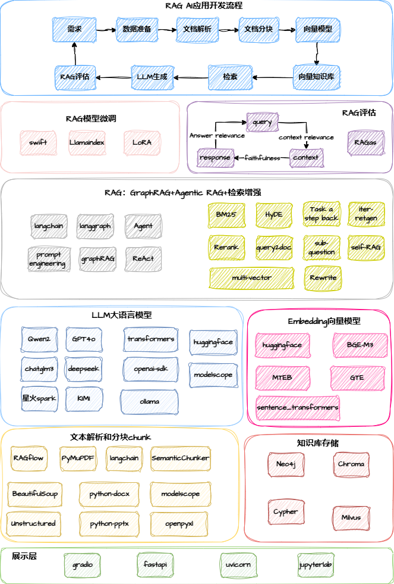

# RAG全栈技术从基础到精通 ，打造高精准AI应用

## 一、目录说明

``` shell
.
├── asset  # 资源包括课程思维导图
├── install # 课程环境安装指南
├── notebook # 课程章节代码notebook
└── README.md

```


## 二、课程说明

课程围绕RAG的三大组件：向量知识库、检索和大语言模型来深度剖析RAG系统的技术细节和方案选型，并通过企业员工助手RAG应用开发实战，展示RAG AI应用开发的从理论到实现的过程，包括文档解析、RAG评估和提升RAG性能的14种检索增强技术等，并将传统RAG拓展到基于知识图谱的GraphRAG和Agentic RAG，让RAG应用有更多的应用空间，同时也详细讲解了RAG系统的模型的微调技术，旨在让你成为全栈的RAG AI应用开发工程师。

**课程导学**


**课程技术栈**



**课程展示**： 


- [RAG erag](https://git.imooc.com/coding-920/RAG_erag)

## 三、课程详细内容

### 1.RAG 3大核心组件和14种检索增强技术

本课程详细讲解了RAG应用开发的三大组件：大语言模型、向量知识库和检索。通过学习，学员将掌握
- （1）大模型的基础知识和应用：token、transformer架构、LLM训练过程、LLM技术演变、LLM涌现能力，评估LLM以及如何为RAG挑选合适的LLM，以及4种的LLM调用方式 
- （2）embedding模型的特点和背后的技术架构，介绍主流embedding模型产品及其选型步骤、3种调用embedding模型方式和2种计算应用 
- （3）详细介绍主流向量数据库chroma/milvus, 深入探讨索引优化技术IVF/HNSW/PQ等，让你更快更好的进行检索 
- （4）14种检索增强技术：6种查询增强，3种多索引增强，2种检索后增强：rerank重排和fuse混合检索（稀疏检索和稠密检索）；以及2种模块增强：迭代增强生成和self-RAG自适应增强，使得学员在构建自己的RAG系统时，能够根据自己的业务场景，选择合适的检索技术，提升RAG的性能。

### 2.RAG智能评估：ragas

构建RAG系统的关键环节之一是对RAG系统进行评估，评估不仅是RAG系统项目验收的标准，也是RAG系统迭代优化的参照基准。通过学习，学员将掌握

- （1）RAG评估的三大评估原则，RAG评估流程以及RAG评估在构建RAG系统的重要迭代作用 
- （2）从原理、数据、评价指标和实现详细讲解RAG自动评估框架ragas，使得学员可以从构建RAG系统的全流程来进行RAG评估

### 3.RAG质量保证：RAG文档解析和分块

RAG系统和其他AI项目一样，高质量的输入数据是RAG系统性能的质量的保证，通过学习，学员将掌握
- （1）著名的垃圾进垃圾出的质量原则，奠定RAG系统开发的质量基调 
- （2）分析构建企业级RAG系统时面临的输入文档多样和复杂性，结合langchain框架实现多种文档的解析 
- （3）基于视觉的文档解析框架RAGFlow deepdoc，认识到文档解析的更多可能 
- （4） 分块技术的重要性，3种典型的分块技术：langchain的传统递归文本分块到基于向量和模型的语义分块

### 4.RAG+：GraphRAG和Agentic RAG

本课程的另一个的特色是将基于传统向量检索的RAG系统，拓展到基于知识图谱的GraphRAG以及将agent技术引入RAG系统构建中，通过学习，学员将掌握
- （1）基于知识图谱的知识的优势和知识图谱的三元组特性 
- （2）构建和操作知识图谱的图数据库，包含neo4j图数据和Cypher查询语言 
- （3） 构建一个有别于传统的RAG的GraphRAG 
- （4）了解agent相关技术和特点，以及ReAct agent框架的实现，并将其应用到RAG系统中，实现一个智能的RAG路由，更精准的提升多文档的RAG系统，通过以上理论和实战，使得学员能够将更多的工具和能力囊括到RAG体系构建中。


### 5. 6大AI应用开发软技能

本课程除了详细讲解RAG的全栈体系以外，还考虑到AI应用开发和传统软件工程开发的不同，穿插讲解了AI应用开发过程中需要的一些软技能，使得学员能够在AI应用开发入门或者转型过程中，更加有的放矢。通过学习，学员将掌握
- （1）项目不同角色对AI大模型了解程度差异性，指定符合自身角色的技术发展路线 
- （2） AI应用开发要注重迭代baseline思维 
- （3）企业级应用的高可用设计、良好的代码规范和代码管理 
- （4）适应AI技术的不断发展，学会如何自我学习，跟进前沿技术 
- （5）AI面试的一些技巧

### 6.2大模型微调技术
本课程针对两种在RAG系统构建过程中涉及的模型：向量embedding模型和大语言模型，基于数据安全和领域适应的角度，讲解了这两种模型的高效微调技术，通过学习，学员将掌握
- （1）为什么要微调，如何在资源有限的情况下进行高效微调
- （2）基于swift微调框架的Lora大语言模型微调过程 
- （3）基于llamaindex框架的embedding模型微调过程

