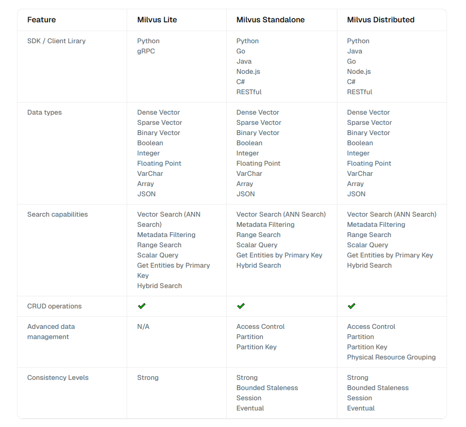

## 知识驱动的智能对话-RAG全栈技术实战指南-环境安装文档

**本课程主要涉及以下运行环境**

- python软件包管理软件：anaconda3/miniforg3
- python环境：3.9和相关package （python nlpk torch langchain llamaindex jupyter-lab等）
- RAGFlow deepdoc
- 向量数据库：chroma/milvus
- 图数据库： neo4j
- 模型下载
- GPU环境安装(可选)
- ollama安装（可选）

**安装文档和章节对应关系说明**

文档中提供了windows、linux和Mac环境的安装，请根据自己的环境安装对应的部分（linux只要安装linux部分，windows只要安装windows部分）其他章节的具体的依赖：

- 基本环境：【一和二】
- 第3-4章：【一、二和六】（七和八可选，如果大模型是使用api）
- 第5章：需要安装向量数据库，对应【四】
- 第6章：有使用RAGflow 需要安装 【三】
- 第10章：使用到图数据库，需要安装neo4j， 需要安装【五】

### 一、python软件包管理软件：Conda
Conda是一个开源的包管理系统和环境管理器，主要用于简化Python及其他语言的软件包管理和项目环境管理。它最初由Anaconda公司开发，广泛用于数据科学、机器学习和科学计算等领域。

目前主流有anaconda3和miniforg3, anaconda3对于企业有版权限制，miniforg3为替代方案，对于个人用户无影响。


#### **ananconda3 安装**

- 软件包下载：https://mirrors.tuna.tsinghua.edu.cn/anaconda/archive/


``` shell
# linux安装
# Anaconda3-5.3.1-Linux-x86_64.sh

sh Anaconda3-5.3.1-Linux-x86_64.sh -b -u -p /root/anaconda3
export PATH="~/anaconda3/bin:$PATH"
conda config --add channels https://mirrors.tuna.tsinghua.edu.cn/anaconda/pkgs/free/         
conda config --set show_channel_urls yes                                                        
conda update conda                                                         
conda upgrade --all

# windows安装
直接安装 Anaconda3-5.3.1-Windows-x86_64.exe


# Mac 安装
下载 Anaconda3-5.3.1-MacOSX-x86_64.pkg   【 https://mirrors.tuna.tsinghua.edu.cn/anaconda/archive/Anaconda3-5.3.1-MacOSX-x86_64.pkg 】直接安装

# 打开terminal 验证
# anaconda默认配置的是.bash_profile，假如你的Mac终端交互环境是bash的话，打开终端会发现，已经是配置好的环境。输入 conda -V 命令可查看当前安装的anaconda的版本。

conda -V

# 可添加conda国内源
conda config --add channels https://mirrors.tuna.tsinghua.edu.cn/anaconda/pkgs/free/osx-64
conda config --add channels https://mirrors.tuna.tsinghua.edu.cn/anaconda/pkgs/main/osx-64
conda config --set show_channel_urls yes


```


- mac安装参考：https://zhuanlan.zhihu.com/p/350828057


#### **miniforge3安装**（可选）

- 软件包下载：https://conda-forge.org/miniforge/


``` shell
# liunx
sh Miniforge3-24.11.1-0-Linux-x86_64.sh -b -u -p /root/miniforge3
export PATH="~/miniforge3/bin:$PATH"

# windows
直接安装 Miniforge3-24.11.0-0-Windows-x86_64.exe
```


windows可以通miniforge prompt来使用conda


#### **conda命令简单实用说明**

1. **创建新环境**：
   ```bash
   conda create --name myenv
   ```
   创建一个名为`myenv`的新环境。

2. **激活环境**：
   ```bash
   conda activate myenv
   ```
   激活名为`myenv`的环境。

3. **停用环境**：
   ```bash
   conda deactivate
   ```
   停用当前活跃的Conda环境。

4. **列出所有环境**：
   ```bash
   conda env list
   ```
   或
   ```bash
   conda info --envs
   ```
   显示所有已创建的Conda环境。

5. **删除环境**：
   ```bash
   conda remove --name myenv --all
   ```
   删除名为`myenv`的环境。

6. **克隆环境**：
   ```bash
   conda create --name newenv --clone myenv
   ```
   克隆名为`myenv`的环境到`newenv`。

7. **安装包**：
   ```bash
   conda install package-name
   ```
   安装指定的包。

8. **更新包**：
   ```bash
   conda update package-name
   ```
   更新指定的包到最新版本。

9. **删除包**：
   ```bash
   conda remove package-name
   ```
   删除指定的包。

10. **列出已安装包**：
   ```bash
   conda list
   ```
   列出当前环境中已安装的所有包。

11. **搜索包**：
   ```bash
   conda search package-name
   ```
   搜索可用的包。


12. **导出环境**：
   ```bash
   conda env export > environment.yml
   ```
   将当前环境导出为`environment.yml`文件。

13. **从文件创建环境**：
   ```bash
   conda env create -f environment.yml
   ```
   从`environment.yml`文件创建环境。


### 二、python环境安装

- 打开Mac/windows 命令行工具（window是Anaconda prompt， Mac是bash terminal）和远程连接linux

通过conda来创建python环境，通过pip来安装课程的依赖的软件包

``` shell
# 创建一个叫llm的环境 python 3.9的环境
conda create -n llm python=3.9 -y 

# 激活
conda activate llm

pip install --no-cache-dir -i https://pypi.tuna.tsinghua.edu.cn/simple -r rag_requirements.txt
```


通过命令行打开jupyter lab


``` shell
conda activate llm

# 将llm环境添加到kernel中
conda install ipykernel
python -m ipykernel install --user --name llm

# 打开jupyter lab
jupyter lab --allow-root

# 创建一个notebook，kernel选择llm

```


### 三、 RAGFlow

RagFlow 是一个用于构建和部署基于检索增强生成（Retrieval-Augmented Generation，RAG）的应用程序的开源框架。本课程中主要使用RAGflow的文档解析模块deepdoc

- 关于代码说明

**课程中对于ragflow的使用是通过直接引入源码进行调用，所以要使用ragflow必须引入源码相关的模块。**

课程中的 `nootbook`目录中已经包含的`ragflow`的源码和解析文档的视觉模型，目录包括

``` shell
- api
- conf
- deepdoc
- rag
```

当然，也可以自己去官网下载最新代码：

``` shell

# 下载代码
git clone https://github.com/infiniflow/ragflow.git

```


- 依赖库安装

（1）大部分依赖安装已经包含在第二部分的 rag_requirements.txt中，额外安装一些其他的库


``` shell
conda activate llm

pip install -i https://pypi.tuna.tsinghua.edu.cn/simple datire markdown xpinyin peewee werkzeug flask_login elasticsearch elasticsearch_dsl PyPDF2 demjson3

```

**特别注意**

datire库需要C++编译器支持，windows环境下需要vs C++ 14.0编译器，如果系统环境不支持，需要下载vs_buildTools.exe


下载地址：

- win11（2022）：https://aka.ms/vs/17/release/vs_BuildTools.exe
- win10（2019）：https://aka.ms/vs/16/release/vs_BuildTools.exe


（2）下载NLTK 词库
**NTLK数据下载：ragflow需要使用nltk库，需要额外下载一些词表**

``` python

# 部分下载
import nltk
nltk.download('punkt_tab')
nltk.download('wordnet')

# 也可全部下载
import nltk
nltk.download()

```


- https://github.com/nltk/nltk_data

下载以后得数据放在下面的任何一个位置

``` python
import nltk

print(nltk.data.path)
# linux 参考
# ['/root/nltk_data', '/root/miniforge3/envs/llm/nltk_data', '/root/miniforge3/envs/llm/share/nltk_data', '/root/miniforge3/envs/llm/lib/nltk_data', '/usr/share/nltk_data', '/usr/local/share/nltk_data', '/usr/lib/nltk_data', '/usr/local/lib/nltk_data']

# windows参考
# 'C:\\Users\\user/nltk_data', 'D:\\Programs\\anaconda3\\envs\\llm\\nltk_data', 'D:\\Programs\\anaconda3\\envs\\llm\\share\\nltk_data', 'D:\\Programs\\anaconda3\\envs\\llm\\lib\\nltk_data', 'C:\\Users\\user\\AppData\\Roaming\\nltk_data', 'C:\\nltk_data', 'D:\\nltk_data', 'E:\\nltk_data'
```


### 四、向量数据库

#### chroma
- 安装和部署

``` shell

# 已经包含在第二部分的 rag_requirements.txt中
pip install chromadb
```

``` shell
# 服务端部署
chroma run --path ./data

 Usage: chroma run [OPTIONS]                                                                                                                        
 Run a chroma server                                                                                                                                
╭─ Options ───────────────────────────────────────────────────────────────────────────────────────────────────────────────────────────────────────────────────────────────────────────────────────────────────────────────────────────────╮
│ --path            TEXT     The path to the file or directory. [default: ./chroma_data]                                                                                                                                                  │
│ --host            TEXT     The host to listen to. Default: localhost [default: localhost]                                                                                                                                               │
│ --log-path        TEXT     The path to the log file. [default: chroma.log]                                                                                                                                                              │
│ --port            INTEGER  The port to run the server on. [default: 8000]                                                                                                                                                               │
│ --help                     Show this message and exit.                                                                                                                                                                                  │
╰─────────────────────────────────────────────────────────────────────────────────────────────────────────────────────────────────────────────────────────────────────────────────────────────────────────────────────────────────────────╯

```
``` python
客户端使用
import chromadb
chroma_client = chromadb.HttpClient(host='localhost', port=8000)
```

``` python
# 直接使用
import chromadb
client = chromadb.Client()
client = chromadb.PersistentClient(path="./data")
```


#### milvus

milvus分为不同的版本：Milvus Lite, Milvus Standalone, and Milvus Distributed。 不同的数据规模和性能要求对应不同的版本





- 参考文档

    ``` shell
    https://milvus.io/docs/install-overview.md

    ```

- milvus Lite安装

    ``` shell
    # 已经包含在第二部分的 rag_requirements.txt中
    pip install pymilvus


    # 本地使用

    from pymilvus import MilvusClient
    client = MilvusClient("./milvus_demo.db")

    ```


- milvus Standalone部署

    milvus Standalone只支持docker部署
    - https://milvus.io/docs/install_standalone-docker-compose.md
    
        
    ``` shell

    # 方式一
    curl -sfL https://raw.githubusercontent.com/milvus-io/milvus/master/scripts/standalone_embed.sh -o standalone_embed.sh

    bash standalone_embed.sh start
    bash standalone_embed.sh stop
    bash standalone_embed.sh delete

    ```

    ``` shell
    # 方式二
    # 通过docker-compose
    mkdir milvus_compose
    cd milvus_compose
    wget https://github.com/milvus-io/milvus/releases/download/v2.2.8/milvus-standalone-docker-compose.yml -O docker-compose.yml
    
    sudo systemctl daemon-reload
    sudo systemctl restart docker

    # 启动服务
    docker-compose up -d

    # 安装 python接口库
    pip install pymilvus

    ```


### 五、图数据库

本课程使用的图数据库是neo4j 社区版本


neo4j为java开发的，服务端安装分为2个部分

- jdk安装
- neo4j软件安装

**jdk安装**

``` shell
# jdk 版本  java 17.0.12 2024-07-16 LTS


# linux
wget https://download.oracle.com/java/17/latest/jdk-17_linux-x64_bin.rpm
rpm -ivh jdk-17_linux-x64_bin.rpm


# windows
1.下载 https://www.oracle.com/java/technologies/downloads/?er=221886#java17-windows
2.点击安装 jdk-17.0.13_windows-x64_bin.exe
3.设置环境变量 JAVA_HOME  PATH=
# D:\Program Files\Java 为你的安装路径
JAVA_HOME D:\Program Files\Java\jdk17.0.13
PATH D:\Program Files\Java\jdk17.0.13\bin;D:\Program Files\Java\jdk17.0.13\jre\bin;

4.打开cmd 验证下
java -version


# mac 安装
- 参考：https://blog.csdn.net/weixin_61536532/article/details/126791735

```


**neo4j安装**

下载路径

- https://neo4j.com/deployment-center/


``` shell
# linux安装
# 方式一: yum 安装
rpm --import https://debian.neo4j.com/neotechnology.gpg.key
cat << EOF >  /etc/yum.repos.d/neo4j.repo
[neo4j]
name=Neo4j RPM Repository
baseurl=https://yum.neo4j.com/stable/5
enabled=1
gpgcheck=1
EOF
yum install neo4j-5.26.0

# 方式二: rpm安装
curl -O https://dist.neo4j.org/rpm/neo4j-5.26.0-1.noarch.rpm
curl -O https://dist.neo4j.org/rpm/neo4j-enterprise-5.26.0-1.noarch.rpm


# neo4j启动和停止
neo4j start
neo4j stop

# 访问 http://localhost:7474 (或者直接ip)
# username 'neo4j' and password 'neo4j'

```


``` shell
# windows 安装
1. 下载https://dist.neo4j.org/neo4j-community-5.26.0-windows.zip
2. 解压neo4j-community-5.26.0-windows.zip 到某个路径 比如D:\neo4j\
3. 设置环境变量 PATH D:\neo4j\bin
4. 打开cmd启动服务： neo4j  windows-service install
5. neo4j start
6. neo4j stop

# 访问 http://localhost:7474 
# username 'neo4j' and password 'neo4j'

```


``` shell
# Mac 安装
1. 下载https://dist.neo4j.org/neo4j-community-2025.02.0-unix.tar.gz
2. 解压neo4j-community-5.26.0-windows.zip 到某个路径 tar -xf neo4j-community-2025.02.0-unix.tar.gz 比如 /root/neo4j
3. 打开terminal启动服务： /root/neo4j/bin/neo4j start

# 访问 http://localhost:7474 
# username 'neo4j' and password 'neo4j'

```


参考

- https://neo4j.com/docs/operations-manual/current/installation/windows/
- https://neo4j.com/docs/operations-manual/current/installation/linux/rpm/#linux-rpm-install-standard
- https://neo4j.com/docs/operations-manual/current/installation/osx/


### 六、模型下载

本课程涉及到模型都主要来自开源模型（使用名字搜索即可）
- modelscope: https://modelscope.cn/models     
- huggingface: https://huggingface.co/models

ps: huggingface国内访问不了，可以使用镜像站访问： https://hf-mirror.com/


### 七、GPU环境安装(可选)

这里的GPU特指nvidia GPU，安装GPU环境主要包括：

- GPU显卡驱动
- GPU开发环境：cuda和cdnn （CUDA是NVIDIA推出的用于自家GPU的并行计算框架；cuDNN是一个SDK，是一个专门用于神经网络的加速包）


**GPU显卡驱动**

根据你购买的nvidia显卡的型号，选择合适的驱动
- https://www.nvidia.cn/drivers/lookup/


``` shell

sh NVIDIA-Linux-x86_64-550.142.run

# 测试是否安装成功

nvidia-smi
```


**GPU开发环境**

以linux centos 7例子为例子

``` shell

# cuda  https://developer.nvidia.com/cuda-toolkit-archive
# https://developer.nvidia.com/cuda-11-8-0-download-archive?target_os=Linux&target_arch=x86_64&Distribution=CentOS&target_version=7&target_type=rpm_local

wget https://developer.download.nvidia.com/compute/cuda/11.8.0/local_installers/cuda-repo-rhel7-11-8-local-11.8.0_520.61.05-1.x86_64.rpm
sudo rpm -i cuda-repo-rhel7-11-8-local-11.8.0_520.61.05-1.x86_64.rpm
sudo yum clean all
sudo yum -y install nvidia-driver-latest-dkms
sudo yum -y install cuda


# cudnn https://developer.nvidia.com/rdp/cudnn-archive
# 需要注册
wget https://developer.nvidia.com/downloads/compute/cudnn/secure/8.9.5/local_installers/11.x/cudnn-linux-x86_64-8.9.5.30_cuda11-archive.tar.xz/  

# 解压会得到cuda目录，复制到已经安装好的cuda目录
cp cuda/include/cudnn.h /usr/local/cuda/include
cp cuda/lib64/libcudnn* /usr/local/cuda/lib64

# 必要情况下可以设置环境变量
export CUDA_HOME=/usr/local/cuda-11.8 
export PATH=/usr/local/cuda-11.8 /bin:$PATH 
export LD_LIBRARY_PATH=/usr/local/cuda-11.8 /lib64:$LD_LIBRARY_PATH 
export LD_LIBRARY_PATH="/usr/local/cuda-11.8 /lib:${LD_LIBRARY_PATH}"

nvcc -V


```


**windows**


### 八、ollama安装（可选）

Ollama是一个集成了多种大型语言模型的工具，它支持模型的部署、运行以及API的整合和调用

- https://ollama.com/download/linux

- 安装Ollama：
```shell
curl -fsSL https://ollama.com/install.sh | sh
```

- 验证安装：
```shell
# 输入来验证安装是否成功。
ollama --version
```

- 使用

``` shell
# 启动服务
ollama serve

# 运行模型

ollama run qwen2:70b

```


ollama 支持最流行的模型

- https://ollama.com/search


## 九、部分软件网盘下载地址

通过网盘分享的文件：install
链接: https://pan.baidu.com/s/18lWxy0fcDj662IuVPmb7Qw 提取码: 7bjh

### 十、说明

由于软件安装系统和版本迭代会随着时间发生变化，在安装过程中如遇到问题可以具体问题具体分析。