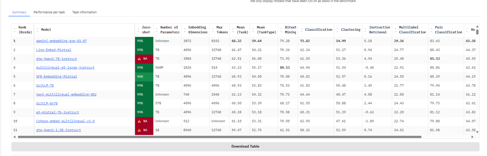

# embedding模型下载

## 1. 下载方法

embedding的下载方法和大语言模型下载方法和途径是一样的

- ModelScope
- huggingface

具体的使用详见【大语言模型是如何下载.md】
- https://git.imooc.com/coding-920/RAG_full_stack_course_notebooks/src/master/install/%e5%a4%a7%e8%af%ad%e8%a8%80%e6%a8%a1%e5%9e%8b%e5%a6%82%e4%bd%95%e4%b8%8b%e8%bd%bd.md


可以在ModelScope和huggingface中进行模型搜索

## 2. 课程中使用embedding模型下载路径

- gte-large-zh
   - https://huggingface.co/thenlper/gte-large-zh
   - https://hf-mirror.com/thenlper/gte-large-zh
   - https://www.modelscope.cn/models/AI-ModelScope/gte-large-zh

``` shell
huggingface-cli download --resume-download thenlper/gte-large-zh --local-dir gte-large-zh
```

- bge-m3
   - https://huggingface.co/BAAI/bge-m3
   - https://hf-mirror.com/BAAI/bge-m3
   - https://www.modelscope.cn/models/BAAI/bge-m3

``` shell
huggingface-cli download --resume-download BAAI/bge-m3 --local-dir bge-m3

git clone https://www.modelscope.cn/BAAI/bge-m3.git

``` 


## 3. MTEB 评测榜单地址


- https://huggingface.co/spaces/mteb/leaderboard_legacy

最新地址：
- https://huggingface.co/spaces/mteb/leaderboard

