# 大语言模型如何下载

## 1. modelscope使用说明

ModelScope是阿里巴巴推出的开源模型即服务（MaaS）平台，它集成了众多领先的预训练模型，旨在为AI开发者提供一站式、易用且低成本的模型服务解决方案。

ModelScope的主要功能包括以下几个方面：

1. **模型库**：ModelScope汇集了各领域最先进最新的机器学习模型，包括但不限于自然语言处理、计算机视觉、语音识别等。这些模型已经过训练和优化，开发者可以直接使用，无需从头开始训练，从而节省了大量时间和资源。
2. **数据集**：平台提供了方便共享及访问的数据集合，可用于算法训练、测试、验证。这些数据集通常以表格形式出现，按照模态可划分为文本、图像、音频、视频、多模态等，为开发者提供了丰富的数据资源，有助于提升模型的性能和准确性。
3. **模型管理与优化**：ModelScope支持模型的版本控制、缓存管理等功能，使开发者能够高效地管理自己的模型。此外，平台还提供了模型性能的监控与分析工具，帮助开发者了解模型权重的分布情况以及模型的预测准确度等关键指标。通过这些信息，开发者可以对模型进行调优和优化，提升模型的效率和准确性。
4. **模型应用可视化私域空间**：ModelScope的创空间（Studio）为开发者提供了一个模型应用可视化的私域空间。在这里，开发者可以基于平台上的模型原子能力，自行搭建与展示不同的AI应用，包括自定义的模型输入输出、多模型的组合以及可视化交互展现形式等。这为开发者提供了一个灵活且强大的工具，用于探索和实现各种创新的AI应用。
5. **开源与共享**：作为一个开源项目，ModelScope鼓励开发者共享自己的模型和代码，促进社区内的交流与合作。通过参与ModelScope社区，开发者可以获取最新的AI技术动态，学习他人的优秀实践，并共同推动AI技术的发展。


- https://www.modelscope.cn/home


（1）**模型下载**

- https://www.modelscope.cn/models


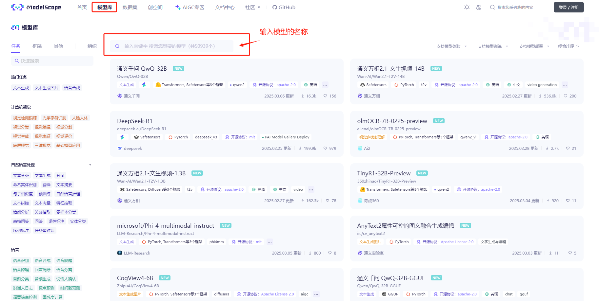


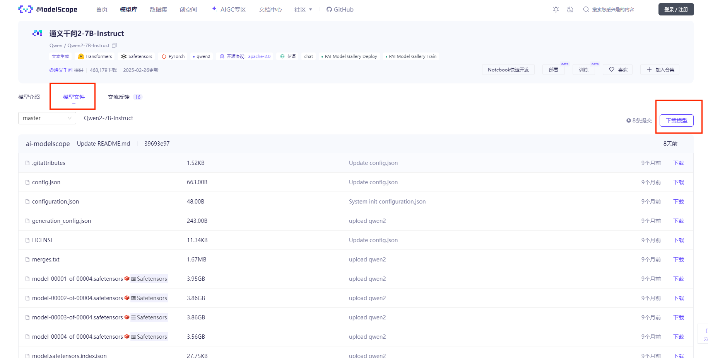


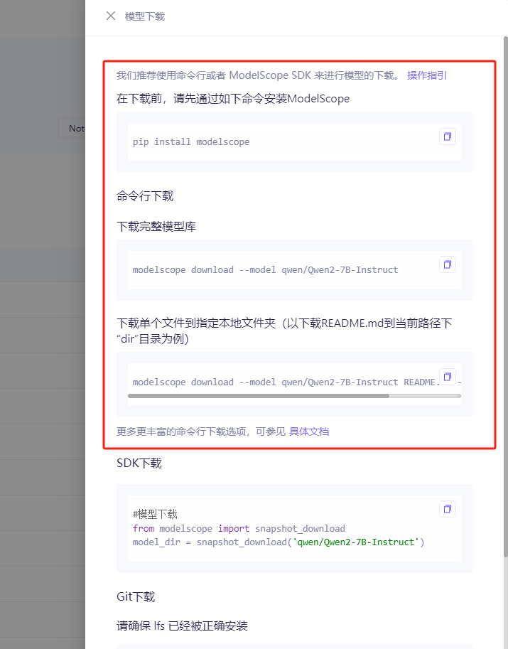


**建议下载到指定路径, 这个路径为`model_path`**


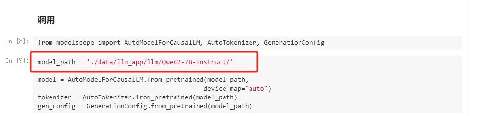

``` python
# pip install modelscope

conda activate llm
modelscope download --model qwen/Qwen2-7B-Instruct README.md --local_dir ./data/llm_app/llm/Qwen2-7B-Instruct/
```

**Qwen2-7B-Instruct目录里所有文件都下载**

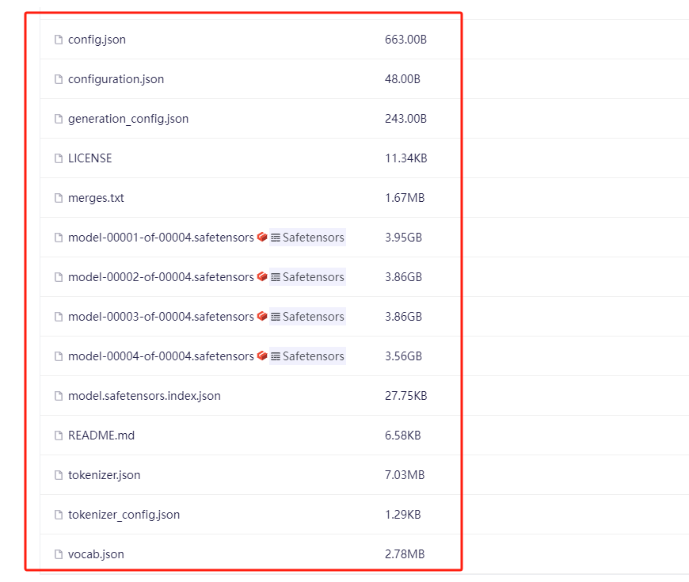


有git环境的建议采用git来下载

``` shell

# git 下载的路径 为 程序中的model_path
# linux环境可以centos： yum install git
# windows 环境可以下载git window客户端， 执行git bash 
git lfs install
git lfs clone https://www.modelscope.cn/qwen/Qwen2-7B-Instruct.git

```

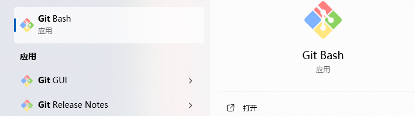

需要等等下载结束, 等光标结束（下面的状态为正在下载）

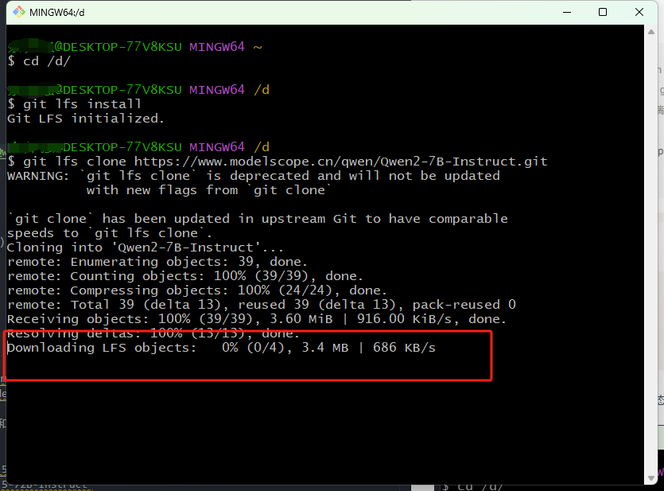

此时 `model_path=r'D://Qwen2-7B-Instruct'`


（2）**课程中使用到的大语言模型下载**

- Qwen2-7B-Instruct： https://www.modelscope.cn/models/qwen/Qwen2-7B-Instruct/files

- chatglm3-6b-32k: https://www.modelscope.cn/models/ZhipuAI/chatglm3-6b-32k/files

其他的模型可以自行在modelscope上下载，如qwen2.5 和 deepseek r1 等

qwen2.5 72b： 
- https://www.modelscope.cn/models/Qwen/Qwen2.5-7B-Instruct
- https://www.modelscope.cn/models/Qwen/Qwen2.5-72B-Instruct 


deepseek r1（deepseek r1 建议采用ollama和vllm部署）：
- https://www.modelscope.cn/models/deepseek-ai/DeepSeek-R1-Distill-Qwen-7B
- https://www.modelscope.cn/models/deepseek-ai/DeepSeek-R1-Distill-Qwen-32B


## 2. huggingface

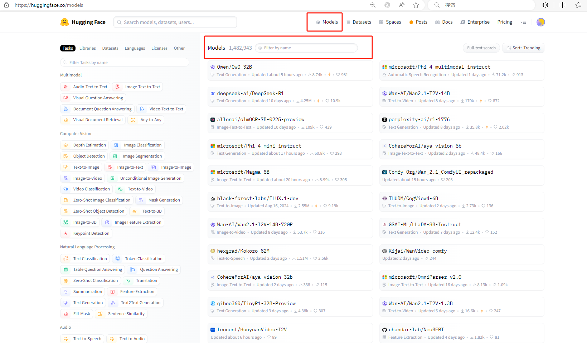

- https://huggingface.co/models

Hugging Face是一个机器学习（ML）和数据科学平台及社区， 和modelscope功能类型，但目前国内无法访问，可以通多镜像站来下载模型和数据集。

镜像站为：
- https://hf-mirror.com/models


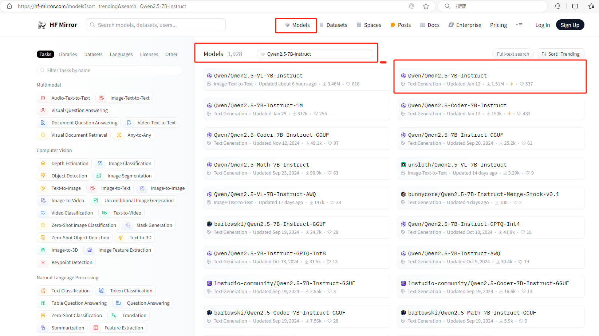

**网页直接下载**

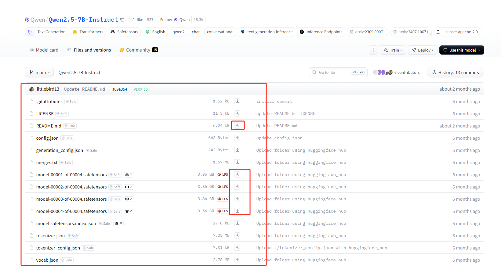


**huggingface cli工具**


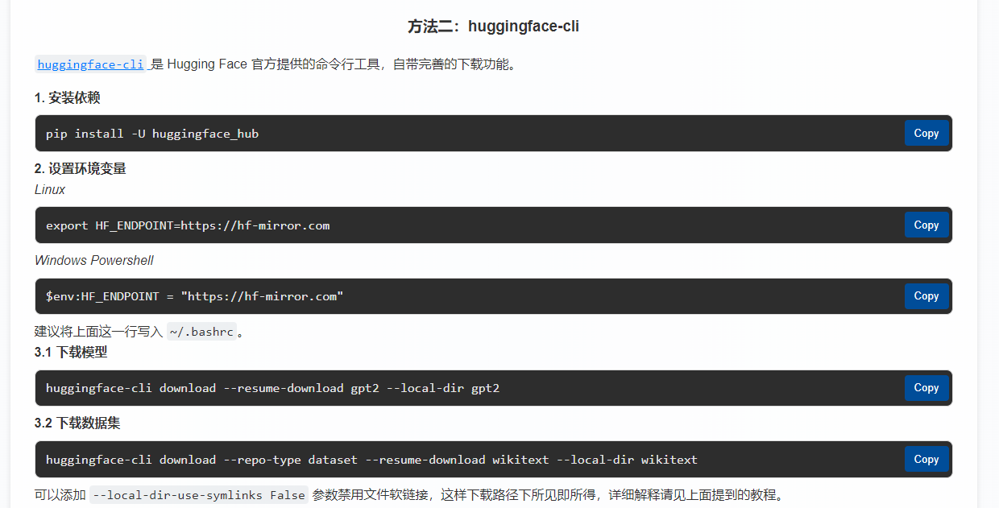

``` python
conda activate llm

pip install -U huggingface_hub
# Linux
export HF_ENDPOINT=https://hf-mirror.com

# Windows Powershell
$env:HF_ENDPOINT = "https://hf-mirror.com"

# model_path 为Qwen2.5-7B-Instruct, 建议设置local-dir，方便管理
huggingface-cli download --resume-download Qwen/Qwen2.5-7B-Instruct --local-dir Qwen2.5-7B-Instruct

```

**课程中使用到的大语言模型下载**

- Qwen2-7B-Instruct：https://hf-mirror.com/Qwen/Qwen2-7B-Instruct/tree/main
- chatglm3-6b-32k: https://hf-mirror.com/THUDM/chatglm3-6b-32k


**这里的模型和modelscope的模型权重都是一样，没有必要重复下载，国内建议在modelscope下载**

## 3. 模型的使用

上面1和2 下载的都是模型的配合和权重参数，比如你下载的路径为 `D://Qwen2-7B-Instruct`


再次强调：将这个路径替换掉代码中`model_path`即可，使用采用transformers和modelscope调用大语言模型的方式。


- ollama和api的使用详情在其他文档说明。