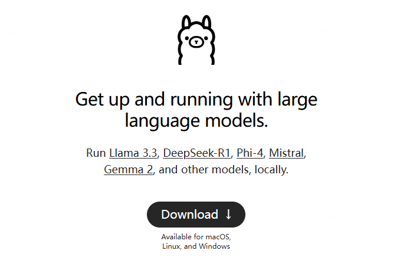
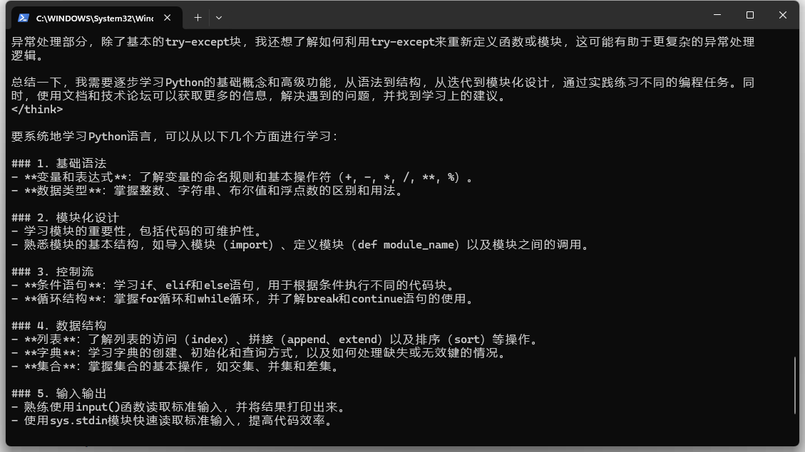

# 如何通过ollama部署本地大模型-deepseek-r1


## 1. **Ollama**

ollama 官网：

- https://ollama.com



--- 

Ollama 是一个开源的大型语言模型运行框架，旨在帮助用户快速在本地部署和运行大模型。它通过简化的命令行界面和 API 接口，使得用户无需复杂的配置即可轻松使用大模型。

### 核心特点
- **易用性**：Ollama 提供了直观的命令行工具，用户只需一条命令即可启动大模型，例如 `ollama run llama3`。
- **多平台支持**：支持 macOS、Windows 和 Linux 系统，用户可以通过 Docker 容器或直接安装的方式运行。
- **多模型支持**：Ollama 支持多种流行的开源大模型，如 Llama、Falcon、Code Llama 等，并允许用户通过 Modelfile 导入自定义模型。
- **本地化运行**：不依赖云端服务，用户可以在本地设备上运行模型，保护数据隐私。
- **GPU/CPU 混合模式**：支持根据硬件配置选择运行模式，优化性能。

### 架构与工作流程
Ollama 采用经典的 Client-Server 架构：
- **Client**：通过命令行与用户交互。
- **Server**：负责加载和运行模型，核心组件包括 `ollama-http-server`（处理客户端请求）和 `llama.cpp`（作为推理引擎）。
- **存储结构**：本地存储路径为 `$HOME/.ollama`，包含日志文件、密钥文件和模型文件（如 `blobs` 和 `manifests`）。

### 使用场景
- 开发者快速测试和部署大模型。
- 企业本地化部署大模型，保护数据隐私。
- 教育与研究领域，用于模型实验和教学。

---

**llama.cpp**
llama.cpp 是一个开源的 C++ 库，专注于加载和运行 LLaMA 系列大模型。它通过量化和优化技术，使得大模型能够在资源有限的设备上运行。

核心特点
- **轻量化**：llama.cpp 通过量化技术（如 GGUF 格式）大幅降低模型对硬件资源的需求，使其能够在低配置设备（如树莓派）上运行。
- **跨平台支持**：支持多种硬件平台，包括 ARM 架构设备（如树莓派 Zero）和 x86 架构设备。
- **高性能优化**：通过 C++ 实现的高效推理代码，能够在低资源设备上实现可接受的推理速度。
- **灵活性**：支持从 Hugging Face 等平台下载模型，并转换为 GGUF 格式后运行。

使用场景
- 在资源受限的设备（如树莓派、手机）上运行大模型。
- 开发者进行模型推理优化和实验。
- 教育与研究领域，用于低资源环境下的模型部署。

---

**Ollama 与 llama.cpp 的关系**
- **依赖关系**：Ollama 依赖于 llama.cpp 作为其推理引擎，llama.cpp 提供了底层的模型加载和推理功能，而 Ollama 在此基础上提供了更高级的管理和交互功能。
- **功能互补**：llama.cpp 更适合技术开发者进行底层优化和实验，而 Ollama 更适合普通用户快速部署和使用大模型。

---


## 2. linux 安装

通过下载`install.sh`来下载

``` shell
curl -fsSL https://ollama.com/install.sh | sh

```

脚本中会从`https://ollama.com/download`下载安装文件
``` shell
curl --fail --show-error --location --progress-bar -o $TEMP_DIR/ollama "https://ollama.com/download/ollama-linux-${ARCH}${VER_PARAM}"

```

如果下载有问题，做了本地版本的详见下面链接，解压下载

``` shell
# 通过网盘分享的文件：ollama_local.zip
# 链接: https://pan.baidu.com/s/1l4SqFEdNiFrg48kOAnqLrQ 提取码: hhg8

sh install.sh

# 验证
ollama --version

# ollama version is 0.3.1
```


参考文档：
- https://github.com/ollama/ollama/blob/main/docs/linux.md
- https://github.com/ollama/ollama/blob/main/docs/faq.md

## ollama 命令和启动


``` shell
# 启动服务
# 后台执行nohup ollama serve > serve.log 2>&1 &
ollama serve

# 下载和启动模型
ollama run deepseek-r1:1.5b

# 模型默认下载路径为：/usr/share/ollama/.ollama/models

```


## 3. windows 安装





## 4. deepseek-r1 蒸馏版本使用


deepseek-r1是长思考的推理模型
- 思考部分用 `<think></think>` 剩下的部分为大语言模型的回答

如果只有CPU的机器，内存的最低要求：


## 5. QWQ 推理模型


``` shell

ollama run qwq
```


- https://qwenlm.github.io/zh/blog/qwq-32b/

- 如果是CPU推理的机器，模型需要占内存 20GB


QWQ也是长思考的推理模型
- 思考部分用 `<think></think>` 剩下的部分为大语言模型的回答


## 6. ollama模型本地保存默认路径

``` shell
Linux: /usr/share/ollama/.ollama/models
Windows: C:\Users\%username%\.ollama\models
macOS: ~/.ollama/models
```

## 7. 如果多卡部署ollama

ollama本是是支持GPU多卡（如果单个显存不足的情况，默认会使用多个显卡）

比如NVIDIA GPU


如果想指定某些卡执行，可以通过环境变量来限定（需要重启下服务）

``` shell
export CUDA_VISIBLE_DEVICES=1,2
ollama serve
ollama run qwen2.5:72b

```


