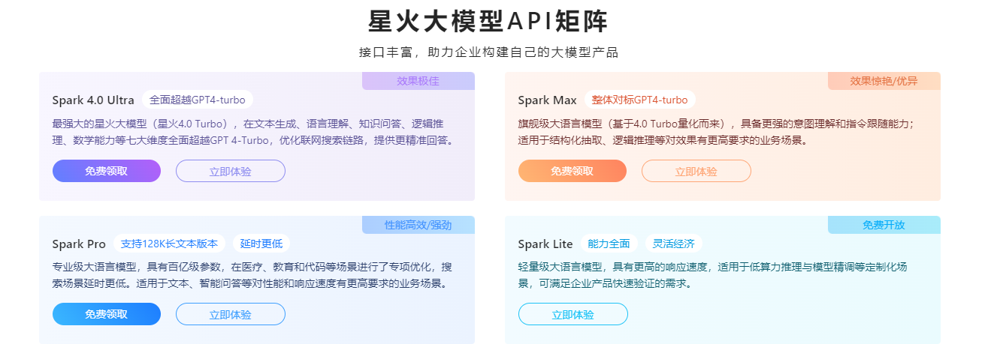
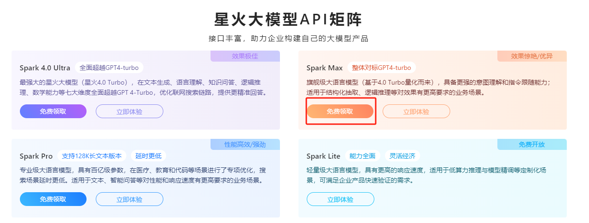
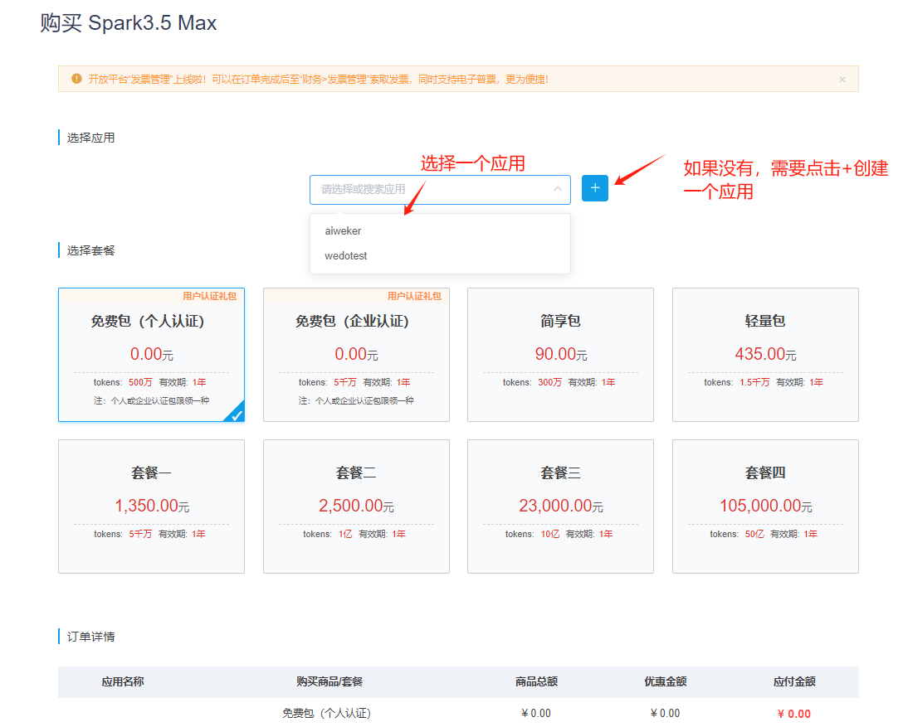
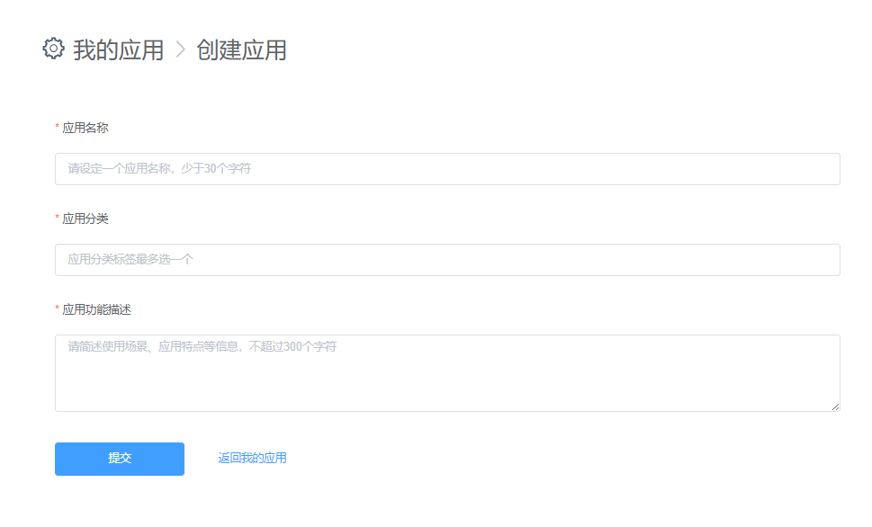
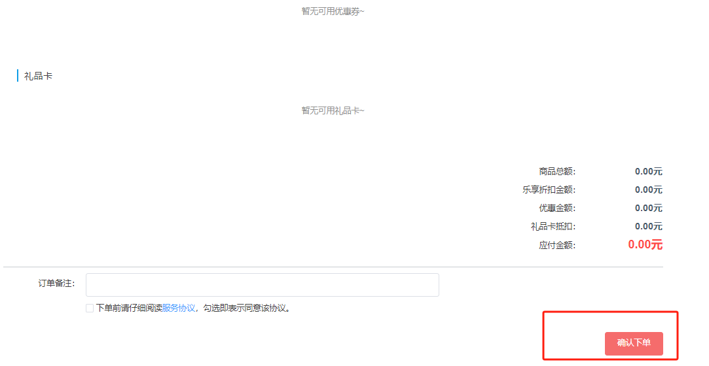
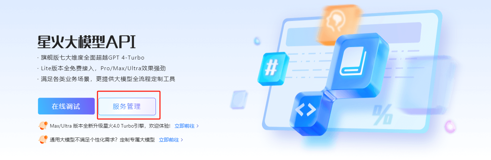
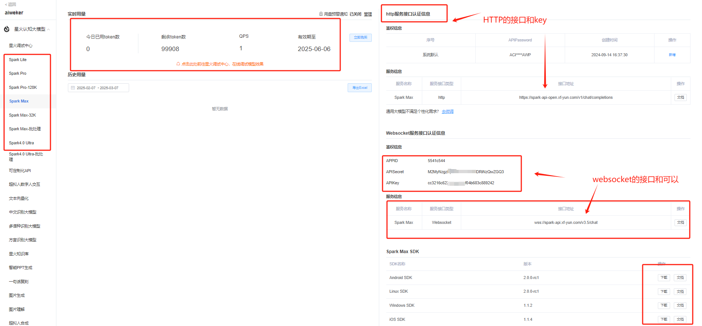
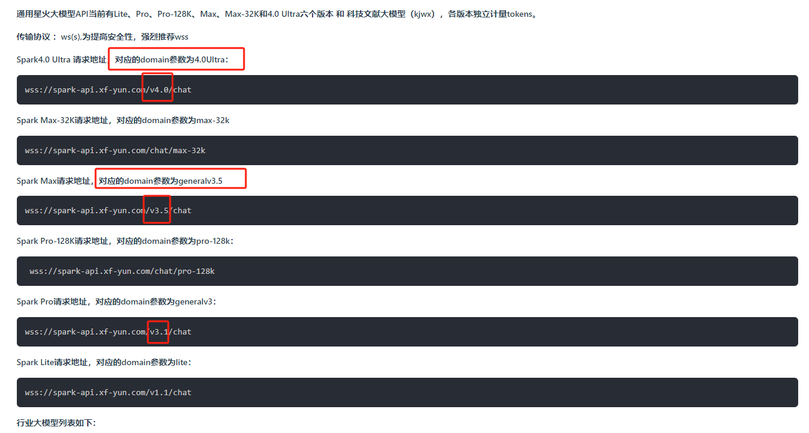

# 星火大模型API使用

## 1. 星火大模型

星火大模型，全称为讯飞星火认知大模型，是科大讯飞公司发布的一款具有强大认知能力的AI模型

星火大模型自发布以来，经历了多次迭代升级，不断提升其性能和功能。以下是其主要的发展历程：

- 2023年5月6日：科大讯飞正式发布讯飞星火认知大模型。
- 2023年6月9日：发布讯飞星火认知大模型V1.5，升级了开放式知识问答、多轮对话等能力。
- 2023年8月15日：发布讯飞星火认知大模型V2.0，进一步升级了代码能力和多模态能力。
- 2023年9月5日：讯飞星火大模型面向全民开放，用户可以在各大应用商店下载使用。
- 2023年10月24日：发布讯飞星火认知大模型V3.0。
- 2024年1月30日：发布讯飞星火认知大模型V3.5。
- 2024年6月27日：发布讯飞星火V4.0，在文本生成、语言理解、知识问答、逻辑推理、数学能力等方面实现对GPT-4 Turbo的整体超越。

## 2. 注册和使用API

讯飞目前提供多种不同程度的大模型API接口，都有免费的额度可以使用。

api：

- https://xinghuo.xfyun.cn/sparkapi#price

注册和使用：以`Spark Max`为例子：

**上面就完成了注册**

**就可以在服务管理中看到具体的token使用和API key等信息**

接口的文档信息

- https://www.xfyun.cn/doc/spark/Web.html#_1-%E6%8E%A5%E5%8F%A3%E8%AF%B4%E6%98%8E

**特别注意：不同的模型接口是不一样的，具体的是：**

请根据自己申请的模型来修改访问的domain和domain_url

**其他AI厂商的API调用可以详细查看各自的API文档和例子**
